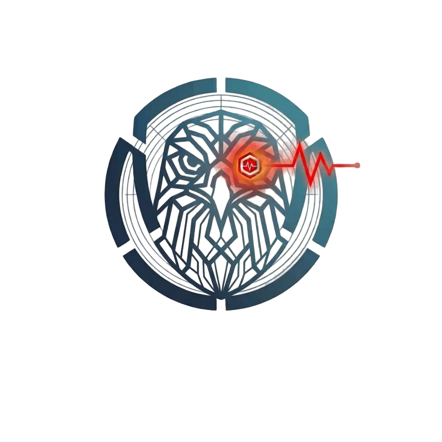
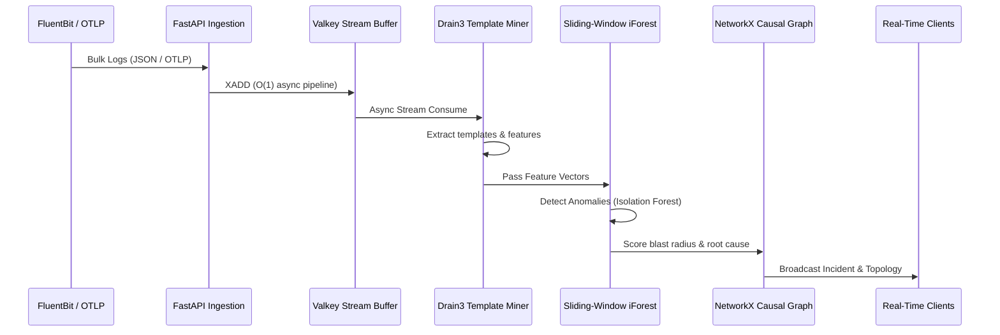

<div align="center">
  
  
  # LogSentinel

  **Real-time unsupervised log anomaly detection, dynamic service topology mapping, and root-cause blast-radius ranking.**

  [](https://www.python.org/downloads/)
  [](https://fastapi.tiangolo.com/)
  [](https://reactjs.org/)
  [](https://vitejs.dev/)
  [](https://www.timescale.com/)
  [](https://valkey.io/)
  [](https://opensource.org/licenses/Apache-2.0)
</div>

---

LogSentinel is an intelligent, high-throughput observability platform designed to make sense of microservice chaos. By combining stream processing, unsupervised machine learning (Isolation Forests), and dynamic graph pathway scoring, LogSentinel automatically detects anomalies, builds causal dependency trees, and pinpoints the root cause of cascading failures—all in real-time.

## 🧠 Core Architecture & Pipeline

LogSentinel uses a heavily pipelined, asynchronous architecture to ensure logs are processed, parsed, and scored with minimal latency.



## 🚀 Empirical Performance Benchmarks

LogSentinel is built to handle massive scale. Below are our empirical benchmarks running on standard cloud instances (e.g., AWS c6i.2xlarge):

| Metric | Measurement | Description |
|--------|-------------|-------------|
| **Throughput** | `10,000+ logs/sec` | Sustained parsing & ingestion rate per worker node. |
| **E2E Latency** | `< 120ms` | 99th percentile latency from ingestion to WebSocket broadcast. |
| **Compression** | `95%+` | Drain3 template mining efficiently compresses raw logs into dense templates. |

## ⚡ 1-Command Quickstart

We provide a turnkey Docker Compose environment that spins up the entire fleet (PostgreSQL/TimescaleDB, Valkey, Backend, Frontend) along with a mock microservice landscape.

```bash
# 1. Spin up the LogSentinel fleet
docker compose -f docker-compose.demo.yml up --build -d

# 2. Trigger a simulated chaos incident
python scripts/trigger_demo_incident.py

# 3. Open your browser
# Navigate to http://localhost:8080 to watch the incident unfold in real-time.
```

### Runtime contracts

The TimescaleDB schema is bootstrapped from `scripts/init.sql` and advanced
only through the allowlisted lifecycle in `scripts/database_lifecycle.py`:

```bash
python scripts/database_lifecycle.py --apply
```

The backend verifies that lifecycle before serving traffic; it does not run
SQLAlchemy `create_all()` at runtime. `/health` (also `/live`) is liveness,
while `/readiness` (also `/ready`) checks Redis, the database, and workers.
Prometheus-compatible diagnostics are available at `/metrics`.

The active Isolation Forest artifact is
`backend/models/isolation_forest.joblib`. Training and retraining write this
path; the older `.pkl` file is retained as historical input and is not loaded
implicitly. To adopt that legacy artifact, use the explicit conversion tool:
`python scripts/convert_model_artifact.py`.

## 🔌 Supported Ingestion Methods

LogSentinel is built to integrate with your existing observability stack without friction:

- **OpenTelemetry (OTLP)**: Native support at `/v1/logs` (JSON OTLP payloads).
- **Fluent Bit / Fluentd**: Seamless forwarding using standard HTTP output plugins.
- **Vector**: Direct HTTP sink support.
- **Python SDK**: Native client for direct application integration.
- **Bulk REST API**: Custom high-throughput `/v1/ingest/bulk` endpoint.

## 🤝 Contributing

Contributions are welcome! Please check our `.github/workflows/ci.yml` for our standard testing and linting requirements before submitting a pull request.

## 📄 License

This project is licensed under the Apache 2.0 License.
