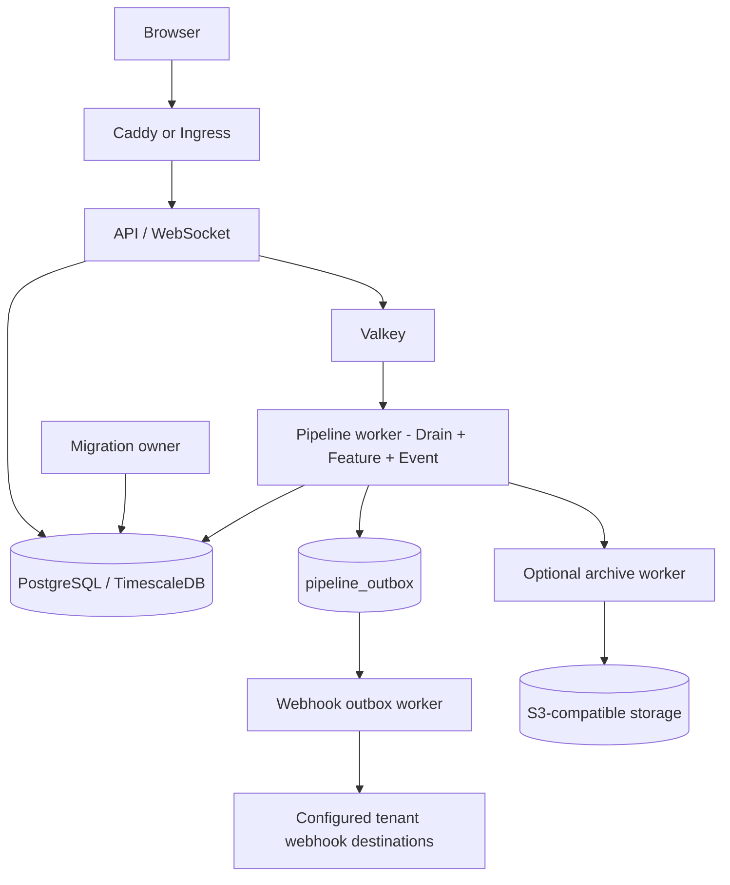

# Authoritative runtime architecture

There is one migration owner per deployment. The API and workers require the
latest recorded migration before serving work. Pipeline handoffs are currently
process-local, so production has one pipeline replica and uses `Recreate`
rollout semantics. Webhook delivery is durable and lease-reclaimable through
`pipeline_outbox`; it does not depend on an in-memory task.
